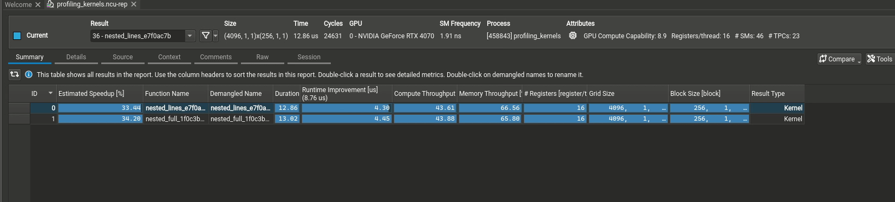
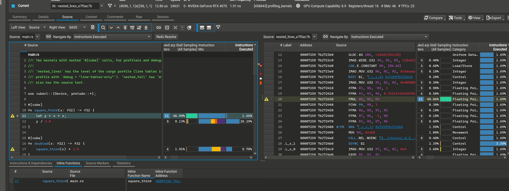
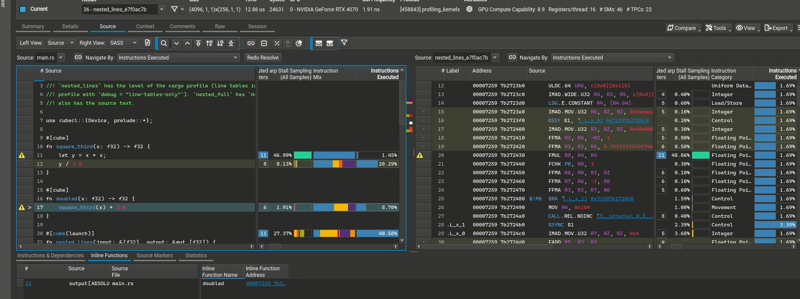
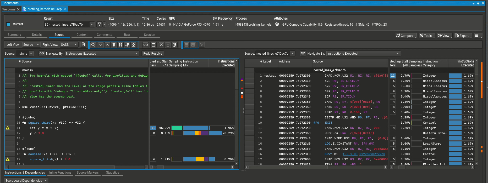

# CUDA: debug data parity with the CPU

| Item | Value |
|---|---|
| Plan step | [PLAN.md §6, step 9](PLAN.md#6-phase-2-keep-locations-through-passes-and-emit-dwarf-llvm-paths--cpu-and-gpu-done) |
| Status | Named inline frames: done ([`9da8f0b`](https://github.com/skewballfox/cubecl/commit/9da8f0b36ba23ce9baa4cac68514e8054815130c)). Compile directory: done ([`45d48d0`](https://github.com/skewballfox/cubecl/commit/45d48d0e8da8f5b7b1b40d3ff80f283ddef00574)). Nsight Compute, cuda-gdb and gdb checks: done, with the example [`profiling_kernels`](https://github.com/skewballfox/cubecl/commit/bcbe4e1ea363ca27d6b17fe34de20086a10f9b7a) (§5). SPIR-V and C++ source directory: done ([`e571785`](https://github.com/skewballfox/cubecl/commit/e571785bcc38441613a619186a3fb7f1e7ff1ced)). Source cache: done ([`f07f139`](https://github.com/skewballfox/cubecl/commit/f07f139cc4edfdf9bfc90d538b97c132b88b90a9)) (§7). |
| Language | ASD-STE100 / Attempto Controlled English. Domain terms are permitted. |

## 1. Parity

The CPU path gives each tool the kernel name, the source lines, the inlined `#[cube]` frames and the source text. This table shows the CUDA paths after this work.

| Data | CPU (LLVM) | CUDA (LLVM) | CUDA (NVRTC, C++) |
|---|---|---|---|
| Kernel name | perf map, jitdump, GDB JIT | CUPTI entry-point name | CUPTI entry-point name |
| Source lines | DWARF | `.loc` in the PTX, `CU_JIT_GENERATE_LINE_INFO` | `#line`, `-lineinfo` |
| Inlined frames, with names | DWARF | `.loc … function_name …, inlined_at …` (this work) | No. The C++ has one function body. |
| Source text | DWARF 5 at `Full` | No. `ptxas` rejects it. | No |
| Path that a tool can open | Absolute, at run time (this work) | Absolute, at run time (this work) | Absolute, at run time (§7) |

## 2. Inline frames had no name

**Found:** NVPTX writes `function_name $L__info_string<n>` for each `.loc` with `inlined_at`. The label points to the linkage name of the `DISubprogram`. `pliron-llvm` gives a linkage name only to the kernel, because an inlined function has no symbol. Thus each inline frame pointed to an empty string.

**Fix:** [`name_inlined_functions`](https://github.com/skewballfox/cubecl/blob/9da8f0b36ba23ce9baa4cac68514e8054815130c/crates/cubecl-llvm/src/nvptx/codegen.rs#L136-L164), called at [`codegen.rs#L103-L104`](https://github.com/skewballfox/cubecl/blob/9da8f0b36ba23ce9baa4cac68514e8054815130c/crates/cubecl-llvm/src/nvptx/codegen.rs#L103-L104), gives each `DISubprogram` without a linkage name its own name as the linkage name. It changes the IR text, as `directives_only` does. The change is on NVPTX only. The CPU and AMDGPU output does not change.

**Checked:**

- The offline test [`inlined_functions_are_named_inline_frames`](https://github.com/skewballfox/cubecl/blob/9da8f0b36ba23ce9baa4cac68514e8054815130c/crates/cubecl-llvm/src/nvptx/offline_tests.rs#L94-L136), on the kernel [`nested_calls`](https://github.com/skewballfox/cubecl/blob/9da8f0b36ba23ce9baa4cac68514e8054815130c/crates/cubecl-llvm/src/shared/offline_kernels.rs#L162-L196), finds `doubled` and `square_third` as `function_name` labels. It fails without the fix.
- `ptxas` 12.9 (wheel `nvidia-cuda-nvcc-cu12`) and `nvdisasm` 13.4 (wheel `nvidia-cuda-nvdisasm`): the SASS has the chain `165 inlined at 171 inlined at 177`. The `.debug_str` of the cubin has the two names. Without the fix, it has an empty string.
- The CUDA driver JIT (`cuLinkAddData` with `CU_JIT_GENERATE_LINE_INFO`, driver 580, RTX 4070) gives the same chain and names. `cuModuleLoadDataEx` uses the same JIT.

## 3. The compile directory

`file!()` gives a path relative to the rustc working directory. A tool finds the file only from that directory. `ptxas` cannot take the source text, so on CUDA the path is the only way for Nsight Compute to show the source.

**Decision:** the binary keeps the relative path. When a kernel compiles, [`source_root`](https://github.com/skewballfox/cubecl/blob/45d48d0e8da8f5b7b1b40d3ff80f283ddef00574/crates/cubecl-llvm/src/shared/source_root.rs#L22-L49) finds the directory that contains the file, and [`convert_module`](https://github.com/skewballfox/cubecl/blob/45d48d0e8da8f5b7b1b40d3ff80f283ddef00574/crates/cubecl-llvm/src/shared/debug_info.rs#L50-L79) gives it to `DebugInfoOptions::directory`. [`DebugState::files`](https://github.com/skewballfox/cubecl/blob/45d48d0e8da8f5b7b1b40d3ff80f283ddef00574/crates/cubecl-ir/src/debug.rs#L103-L126) gives the path of each file at all levels. Before, only `Full` recorded the paths, with the texts. The search roots are `CUBECL_SOURCE_ROOT`, then the working directory and its parents. At `Full`, the file must have the MD5 of the compiled text.

**Reason:** the macro emits the location call in all builds, also with `debug = 0`, because the level is selected at run time. An absolute path from the macro would be a string in every binary. `strip`, `debug = 0` and `--remap-path-prefix` do not remove it, and builds in different directories would not be reproducible. A path that is found at run time is only in the kernel debug data, on the computer that has the source.

**Cost:** the search occurs one time for each file in each process, not for each kernel. Measured in a release build, three runs: the first search of a process approximately 220–240 µs, a file that does not exist approximately 45–75 µs, a file with the MD5 check (5.9 KB) approximately 50 µs, and a later kernel 4–9 µs (a lookup in the cache). A JIT compile takes milliseconds. The MD5 of each source text is also calculated one time for each process now ([`source_md5`](https://github.com/skewballfox/cubecl/blob/45d48d0e8da8f5b7b1b40d3ff80f283ddef00574/crates/cubecl-llvm/src/shared/debug_info.rs#L82-L97)). Before, the CPU and AMDGPU paths calculated it for each kernel at `Full`.

**Applies to:** the CPU, AMDGPU and NVPTX paths, because all three use `convert_module`. This also removes the gdb trap of §3.4 ("the path of the kernel file is relative").

**Limits:**

- A persistent PTX cache entry keeps the directory of the process that wrote it. If the source moves, the tool does not find it. The machine code is the same.
- At `LineTables`, there is no text, so a changed file is not detected.
- The SPIR-V path and the C++ `#line` directives use the search since [`e571785`](https://github.com/skewballfox/cubecl/commit/e571785bcc38441613a619186a3fb7f1e7ff1ced) (§7).

**Checked:** the tests [`the_compile_directory_has_the_source_files`](https://github.com/skewballfox/cubecl/blob/45d48d0e8da8f5b7b1b40d3ff80f283ddef00574/crates/cubecl-llvm/src/shared/debug_info.rs#L317-L352) (CPU IR at `Full` and `LineTables`), [`the_file_directive_is_the_absolute_path`](https://github.com/skewballfox/cubecl/blob/45d48d0e8da8f5b7b1b40d3ff80f283ddef00574/crates/cubecl-llvm/src/nvptx/offline_tests.rs#L94-L110) (NVPTX), and the [`source_root` tests](https://github.com/skewballfox/cubecl/blob/45d48d0e8da8f5b7b1b40d3ff80f283ddef00574/crates/cubecl-llvm/src/shared/source_root.rs#L82-L124). The driver JIT keeps the absolute path in the cubin. Nsight Compute, cuda-gdb and gdb on the CPU find the file (§5).

## 4. Regression checks

- The `cubecl-llvm` tests with `nvptx` and `amdgpu` (69) pass. The `cubecl-ir` tests pass.
- The `cubecl-cpu` suite (812) passes.
- The `cubecl-cuda` suite on the RTX 4070: 746 pass, 52 fail. The same 52 tests fail on `3afcdce`, before this work.
- Clippy with `-W clippy::pedantic` gives no warning on the changed lines.

## 5. Checks on the device

**Kernel:** the example [`profiling_kernels`](https://github.com/skewballfox/cubecl/blob/bcbe4e1ea363ca27d6b17fe34de20086a10f9b7a/examples/profiling_kernels/src/main.rs#L9-L32) has two kernels with the chain `kernel → doubled → square_third`. `nested_lines` has line tables from the cargo profile. `nested_full` has `debug_symbols`, thus `Full`. All checks used the `dev` profile. Nsight Compute also ran on a release profile with `debug = "line-tables-only"`, with the same result.

**Nsight Compute user interface:** the report opens in `ncu-ui` 2025.3.1, in a container on a different computer. The two kernels have 16 registers for each thread, thus `Full` does not change the register count.

The Source page of `nested_lines` shows `main.rs` from the report next to the SASS. The `#[cube]` lines have metrics: line 11 (`square_third`) has 46.99% of the warp stall samples, line 12 has 20.29% of the executed instructions, and line 17 (`doubled`) has 8.70%. On this page, line 17 has fewer executed instructions than line 12. Thus this page does not add the metrics of an inlined line to its call site, as the CSV output does (see below). Lines 11 and 17 have a warning sign. A click on the sign opens the tab "Inline Functions" below the source view. For line 11, the tab shows one call site: line 17 of `main.rs` (`square_third(x)`), with the inline function name `square_third` and its address. The SASS view selects the `FMUL R0, R4, R4` of `x * x`, with 48.86% of the warp stall samples. Thus the user interface shows the names that `name_inlined_functions` gives (§2).

For line 17, the tab shows the next level: the call site line 23 of `main.rs` (`output[ABSOLUTE_POS] = …`), with the inline function name `doubled`. Thus the user interface shows the two levels of the chain `nested_lines → doubled → square_third`.

**Tools:** `ncu` 2025.3.1 and cuda-gdb 13.0, from the NVIDIA CUDA RPM repository for Fedora 42 (`nsight-compute-2025.3.1`, `cuda-gdb-13-0`). `rpmkeys --checksig` accepts both packages with the NVIDIA key `610C7B14…D42D0685`. The packages were unpacked, not installed. The image `nvcr.io/nvidia/cuda` was not used: NVIDIA signs only the manifest list, not the amd64 image, and a policy that requires signatures rejects the image. The driver has `RmProfilingAdminOnly: 0`, thus `ncu` ran without root.

**Nsight Compute** (`ncu --import-source yes --set full`, then `--page source --print-source cuda,sass --csv`):

- The source view shows the `#[cube]` lines from the absolute path `…/examples/profiling_kernels/src/main.rs`, for the two kernels.
- The report contains the file text (1894 bytes, the size of the file). The Python report interface (`IAction.source_files`) gives it.
- `ncu` uses the inline chain. The metrics of line 12 (`square_third`) are also added to its call sites, line 17 (`doubled`) and line 23 or 30 (the kernel). The NVIDIA documentation describes this aggregation for inline functions.
- The command line and the Python report interface do not show the inline function names. Only the "Inline Functions" table of the user interface shows them (see the Source page above). The names are in the cubin (§2).
- The slow path of the `f32` division is a subroutine (`CALL.REL.NOINC`). Its instructions have the line of the `#[cube(launch)]` attribute (line 20 or 27), not the line of the division.

**The search for the compile directory:**

| Working directory | `CUBECL_SOURCE_ROOT` | Path in the report | Text in the report |
|---|---|---|---|
| Workspace root | Not set | Absolute | Yes |
| `examples/profiling_kernels` | Not set | Absolute (a parent directory has the file) | Yes |
| A directory outside the workspace | Not set | Relative. `ncu` writes "Failed to import". | No |
| A directory outside the workspace | Workspace root | Absolute | Yes |
| Workspace root, file changed after the build | Not set | Absolute at `LineTables`. Relative at `Full`, because the MD5 is different. | Yes. `ncu` opens a relative path from its own working directory, thus it imports the changed text. |

**cuda-gdb** (no `-G`, thus the optimization level does not change):

- A breakpoint on line 11 stops at `main.rs:11 in square_third inlined from main.rs:17`. A breakpoint on line 12 stops at `main.rs:17 in doubled inlined from main.rs:23`. The path is absolute, and `list` shows the source. The `Full` kernel gives the same result.
- `bt` shows one device frame. cuda-gdb gives the innermost inline function and its call site in that frame. It does not show each inline frame as a frame of its own.
- `x/i` needs `cuobjdump` on the `PATH`.
- Before the first kernel launch, `break main.rs:11` binds to the host code that the macro generates (`doubled::expand`, line 15). Set the breakpoint after the launch, for example after `set cuda break_on_launch application`.

**gdb on the CPU** (gdb 17.2, the `cpu` runtime, `dev` profile): a breakpoint on line 11 gives `square_third () at …:11`, `doubled () at …:17`, `nested_lines () at …:23`, then `run_kernel`. gdb shows the source from the workspace root, and from a directory outside the workspace with `CUBECL_SOURCE_ROOT`. Without the variable, gdb writes "No such file or directory", but the frames and the lines are correct. This closes "Not checked with gdb" of PLAN §3.4.

**lldb on the CPU** (lldb 23.1.2 from Homebrew, the `cpu` runtime, `dev` profile, the GDB JIT interface of lldb at its default setting):

- From the workspace root, a breakpoint on line 11 stops at `square_third at main.rs:11:13 [inlined]`, `doubled at main.rs:17:5 [inlined]`, `nested_lines at main.rs:23:32`, then `run_kernel`. lldb shows the source. `image lookup -v -a $pc` gives the blocks `doubled` and `square_third` in the kernel.
- From a directory outside the workspace, without `CUBECL_SOURCE_ROOT`, the search finds no directory, and the path stays relative. At `Full`, lldb reads the source text from the DWARF and shows the `#[cube]` lines of `nested_full`. lldb writes the text to a temporary file (for example `/tmp/-8b8ba8.main.rs`), and the frames show that name. gdb does not read the text (PLAN §3.4).
- **Limit:** lldb keeps a file that it did not find, by its path. `nested_lines` and `nested_full` have the same relative path, and only `nested_full` has the text. If lldb shows `nested_lines` first, it does not show the source of line 11 in `nested_full` later. The outer frames of `nested_full` still show the text. If lldb shows `nested_full` first, it shows the text in all frames. A small C program with `-gembed-source`, an empty compile directory and a relative path shows the text in all frames, thus the DWARF of the kernel is not the cause. With `CUBECL_SOURCE_ROOT` or the source cache (§7), the paths are absolute, and this limit does not apply. That was not checked with lldb.

## 6. Not done

- **NVRTC inline frames.** The C++ backend puts all `#[cube]` calls into one function body. Inline frames need a device function for each `#[cube]` function.
- **Source text in the PTX.** `ptxas` rejects it (step-5-followup.md, fact 2). `ncu --import-source yes` copies the files into the report. The source cache (§7) gives a file when the source tree is not on the computer.

## 7. Follow-up: the source directory on all paths, and the source cache

**SPIR-V and C++** ([`e571785`](https://github.com/skewballfox/cubecl/commit/e571785bcc38441613a619186a3fb7f1e7ff1ced)): the search moves from `cubecl-llvm` to [`cubecl_runtime::debug_source`](https://github.com/skewballfox/cubecl/blob/e571785bcc38441613a619186a3fb7f1e7ff1ced/crates/cubecl-runtime/src/debug_source.rs#L29-L59), because `cubecl-llvm`, `cubecl-spirv` and `cubecl-cpp` all depend on `cubecl-runtime`. `kernel_source_root` gives the directory for a kernel, and `source_md5s` gives the MD5s of its texts at `Full`.

- The SPIR-V builder sets `DebugInfoOptions::directory` ([`debug_info.rs#L33-L51`](https://github.com/skewballfox/cubecl/blob/e571785bcc38441613a619186a3fb7f1e7ff1ced/crates/cubecl-spirv/src/debug_info.rs#L33-L51)). `pliron-spirv` already joined the directory to each relative path.
- The C++ `#line` directives join the directory to each relative path ([`branch.rs#L80-L86`](https://github.com/skewballfox/cubecl/blob/e571785bcc38441613a619186a3fb7f1e7ff1ced/crates/cubecl-cpp/src/shared/branch.rs#L80-L86), [`base.rs#L363-L370`](https://github.com/skewballfox/cubecl/blob/e571785bcc38441613a619186a3fb7f1e7ff1ced/crates/cubecl-cpp/src/shared/base.rs#L363-L370)). Thus Nsight Compute finds the file on the NVRTC path too.
- `md-5` moves to the `std` feature of `cubecl-runtime` (approximately 2 KB). The C++ path searches only when the `std` feature of `cubecl-cpp` is on (as in `cubecl-cuda`, `cubecl-hip`, `cubecl-metal` and `cubecl-wgpu`). Without it, the `#line` directives keep the relative paths.
- **Checked:** the tests [`the_file_name_is_the_absolute_path`](https://github.com/skewballfox/cubecl/blob/e571785bcc38441613a619186a3fb7f1e7ff1ced/crates/cubecl-spirv/src/debug_info.rs#L242-L258) (SPIR-V) and `source_lines_are_line_directives` (C++, each `#line` has an absolute path to a file that exists).

**Source cache** ([`f07f139`](https://github.com/skewballfox/cubecl/commit/f07f139cc4edfdf9bfc90d538b97c132b88b90a9)): at `Full`, the binary has the text of each file. When the search finds no directory, and `CUBECL_SOURCE_CACHE` (or `compilation.source_cache`) names a directory, [`cached_root`](https://github.com/skewballfox/cubecl/blob/f07f139cc4edfdf9bfc90d538b97c132b88b90a9/crates/cubecl-runtime/src/debug_source.rs#L137-L203) writes the texts to `<cache>/<tree>/<path>`. The debug data gets `<cache>/<tree>`.

- `<tree>` is the MD5 of the paths and the MD5s of the texts. A changed text gets a different directory, and the kernels with the same files share one.
- A path that leaves its directory (`../k.rs`, `/k.rs`) is not written. Thus the cache writes only under its directory.
- Each file goes to a temporary file, then `rename`, because other processes can write the same tree. The write occurs one time for each tree in each process.
- **Decision:** the cache is off by default, because it writes files that stay after the process stops. Without the variable, the cost is one read of the configuration. It adds no dependency, thus it has no cargo feature.
- **Limits:** only `Full` has texts, so a `LineTables` kernel keeps the relative path. The cache directory is not cleaned. A file that a kernel at `Full` has without its text (a function without `debug_symbols`) is not in the cache.
- **Checked:** the tests [`the_cache_has_the_texts_under_one_directory` and `the_cache_writes_only_under_itself`](https://github.com/skewballfox/cubecl/blob/f07f139cc4edfdf9bfc90d538b97c132b88b90a9/crates/cubecl-runtime/src/debug_source.rs#L291-L325). On the RTX 4070, from a directory outside the workspace, with `CUBECL_SOURCE_CACHE`: Nsight Compute imports the text of `nested_full` from the cache (1930 bytes), and `nested_lines` keeps the relative path. cuda-gdb stops at `…/<tree>/examples/profiling_kernels/src/main.rs:11 in square_third inlined from main.rs:17`, and `list` shows the source.

**Regression checks:** the `cubecl-cpu` suite (812) passes. The `cubecl-cuda` suite has 746 passes and the same 52 failures as `3afcdce`. The `cubecl-llvm` tests with `nvptx` and `amdgpu` (65) pass: four tests moved to `cubecl-runtime` with the search. The `cubecl-runtime`, `cubecl-cpp` and `cubecl-spirv` tests pass. Clippy with `-W clippy::pedantic` gives no warning on the changed lines.
